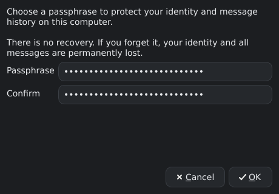
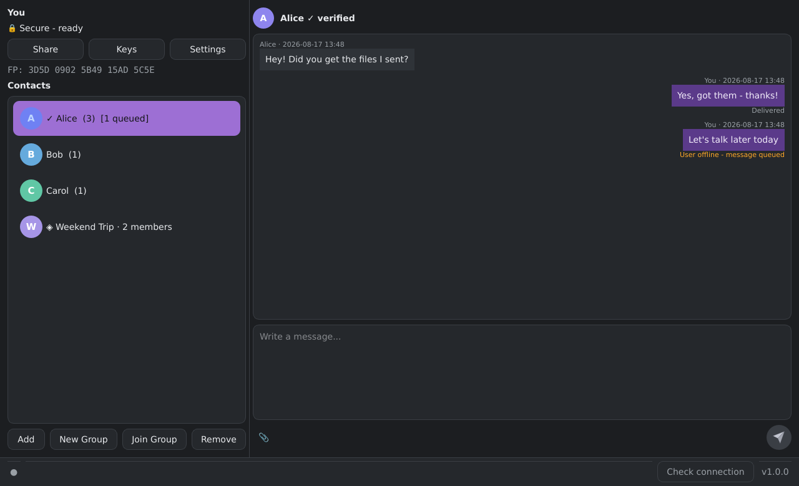
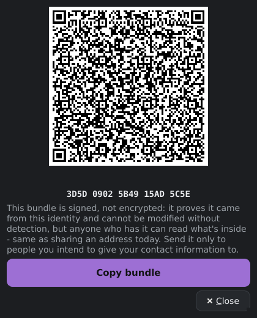
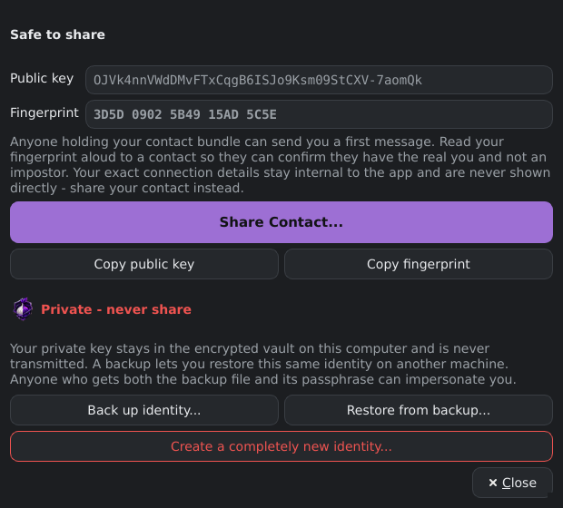
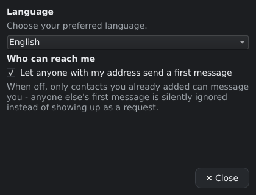
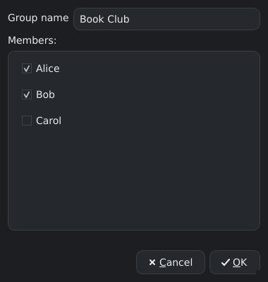
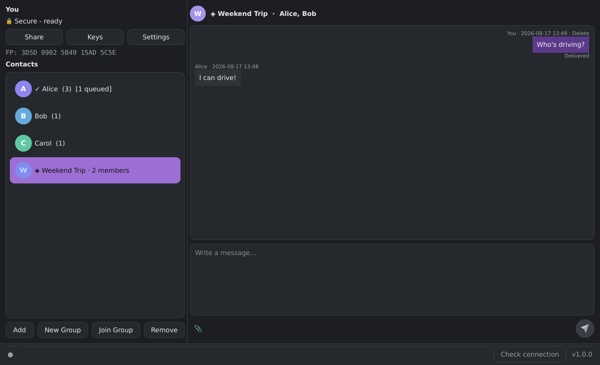
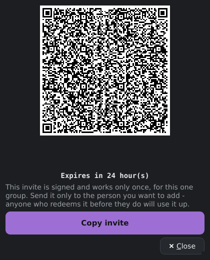
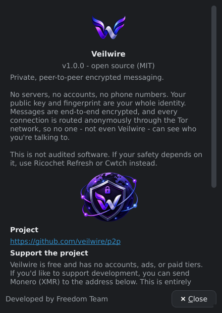

# Veilwire User Guide

A walkthrough of everyday use, with real screenshots from the app and
example/demo data throughout (fake names, a fake passphrase, and
placeholder keys/fingerprints — never use these for anything real).

---

## 1. First launch: create your identity

The first time you open Veilwire, it asks you to choose a passphrase. This
passphrase encrypts your entire local vault (identity, contacts, message
history) — there is no "forgot password" recovery, by design: nobody,
including the developers, can reset it for you.



**Example passphrase** (for illustration only — pick your own, longer and
unique):
```
correct horse battery staple
```

Behind the scenes, Veilwire also generates two key pairs for you
automatically — an encryption key pair and a signing key pair. You never
have to manage these directly; they're what make messages and contact
shares tamper-evident and unreadable to anyone but the intended recipient.

---

## 2. The main window

Once unlocked, you land on the main window: your contacts and groups on
the left, the open conversation on the right.



A few things to notice:

- **"Secure - ready"** at the top left means your Tor connection is up and
  your identity is reachable. It'll briefly say "starting" while Tor
  bootstraps after launch.
- **`FP: 096E B2EC CF15 3BBD D19B`** is your fingerprint — a short,
  human-comparable code derived from your public key. Read this aloud to a
  contact over a call or in person so they can confirm they're really
  talking to you.
- Each contact row shows a message count and, if applicable, how many
  messages are still queued for delivery (e.g. `Alice (3) [1 queued]`).
- **"Delivered"** vs **"User offline - message queued"** under a sent
  message tells you the real, honest delivery state — a queued message
  will keep retrying automatically once your contact comes back online.

---

## 3. Sharing your contact so someone can add you

Click **Share** to get a QR code and a copyable text bundle that a contact
can scan or paste to add you.



The bundle text looks like this (example, not a real identity):
```
P2PMSG1:AbCdEfGhIjKlMnOpQrStUvWxYz0123456789AbCdEfGhIjKlMnOpQrStUvWxYz...
```

This bundle is **signed, not encrypted** — anyone who has it can read what's
inside (your onion address and public key), but they *cannot* tamper with
it: changing a single character invalidates the signature and the bundle
is rejected. Your onion address is never shown anywhere else in the app —
only inside this bundle, so a screenshot of your contact list or a
shoulder-surf never leaks it.

Send this bundle only to people you actually want to be reachable by.

**On the receiving end**, someone adds you by clicking **Add**, pasting
the bundle you sent, and giving you a local name. If your address ever
changes (e.g. you restored from a backup on a new machine), their app
will flag it as an "Identity / Endpoint Changed" warning rather than
silently trusting the new address — they have to explicitly confirm your
fingerprint again before continuing.

---

## 4. Your keys and backup

Click **Keys** to see your public key, fingerprint, and — critically — to
back up your private identity.



**Back up your identity before you need it.** If your device is lost,
wiped, or the vault file is corrupted with no backup, your identity and
message history are gone permanently — there is no recovery mechanism,
matching the "no recovery" warning shown at first launch. Use
**"Back up identity..."** to export an encrypted backup file (protected by
its own passphrase, separate from your vault passphrase), and
**"Restore from backup..."** to bring it back on this or another machine.

---

## 5. Settings: language and who can reach you

Click **Settings** for two things: your display language, and who is
allowed to send you a first message.



- **Language**: choose from English, العربية (Arabic, right-to-left),
  Русский (Russian), or Français (French). Changing it takes effect after
  a restart, which the dialog will prompt you to do.
- **Who can reach me**: on by default, meaning anyone who has your shared
  contact bundle can send you an opening message, which shows up as a
  request you can accept or block. Turn this off if you'd rather only
  hear from people you've already added yourself — everyone else's first
  message is then silently ignored instead of appearing as a request.

---

## 6. Creating a group

Click **New Group**, name it, and check off which of your existing
contacts to include.



A few things worth understanding about how groups work here, since there's
no central server coordinating anything:

- **You become the group's owner.** Only the owner can delete the group
  entirely; everyone else can only leave it (and the rest of the group
  gets notified when someone leaves).
- **Members you name here are added immediately** — no invite needed,
  since you're directly vouching for contacts you already trust. Veilwire
  automatically sends each of them a one-time invite behind the scenes so
  their own app learns the group exists; you don't have to do anything
  extra for this.
- A group message is really several individually encrypted 1:1 messages —
  one per member — sent over Tor exactly like a normal message. There's no
  shared "group chat server" anywhere.



Once inside a group conversation, messages show who sent them, and your
own outgoing messages show an aggregate delivery count (e.g. "Delivered to
2/3") since they went out as separate sends to each member.

---

## 7. Inviting someone to an existing group

To add someone to a group *after* it's already created, open the group's
menu (right-click it in the sidebar) and choose **Create invite...**. Pick
how long the invite should stay valid:



This invite is:

- **Signed** — cryptographically tied to you as the group's owner, so it
  can't be forged or silently modified.
- **Single-use** — once someone redeems it, that exact invite stops
  working for anyone else, even if it was copied to multiple people.
- **Time-limited** — it stops working after the window you chose (1 hour,
  24 hours, or 7 days), regardless of whether it was ever used.

Send the invite text (or let them scan the QR code) to the one person you
want to add. On their end, they click **Join Group** and paste it in.

> **Note:** to join a group via invite, you must already have the
> inviter as an accepted contact on your side first (add them normally,
> as in step 3, if you haven't already) — Veilwire never auto-trusts a
> new identity just because it showed up inside a signed invite.

---

## 8. Sending files and images

Use the attachment button (the small paperclip icon next to the message
box) to send a file or image, in a 1:1 conversation or a group.

**Attachments are never displayed automatically** — whoever receives one
sees a filename, its size, and a **Save As...** link, exactly like any
other file. Nothing is decoded or previewed until you explicitly choose to
save it, and after saving you'll be asked if you'd like to open it right
away with your system's default application. This is deliberate: it keeps
"a message arrived" from ever meaning "unknown bytes were automatically
rendered on my screen."

---

## 9. Deleting a message

Every message you've sent has a **Delete** link. Choosing it removes the
message for you *and* notifies the recipient(s) to remove their copy too
— whether or not it had been delivered yet. Only the original sender of a
message can delete it; nobody can delete a message that isn't theirs.

---

## 10. Learn more / verify the project

The **About** dialog (bottom right, click the version number) has the
project's repository link, an optional way to support development, and a
"Verify our identity" section with the project's own public key and
fingerprint — useful if you ever want to confirm a contact bundle claiming
to be from the Veilwire project itself is genuine.



---

## Good habits

- **Verify fingerprints out of band** (a call, in person, an existing
  trusted channel) before fully trusting a new contact — a bundle proves
  "this wasn't tampered with in transit," not "this is who they claim to
  be."
- **Back up your identity** before you need it, not after.
- **Both sides need the app open** at some point for a message to go
  through — there's no server holding messages for you; your own vault
  keeps retrying queued sends until your contact comes back online.
- **Send invites to one person at a time.** An invite is meant for a
  single recipient — whoever redeems it first is the one who gets in.
